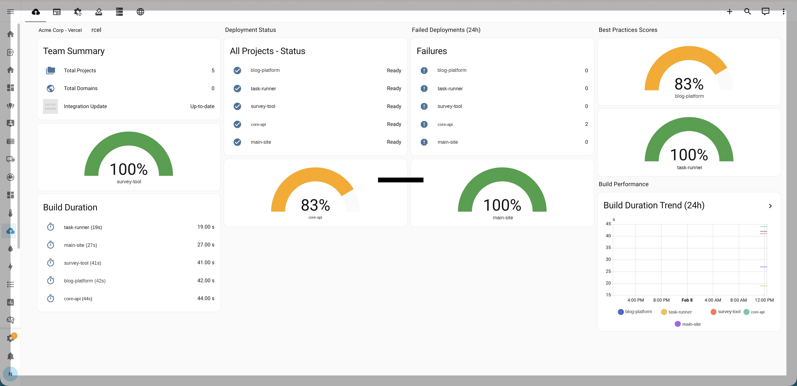

# Vercel for Home Assistant

[](https://github.com/hacs/integration)
[](https://www.home-assistant.io/)
[](LICENSE)

A custom Home Assistant integration that monitors your [Vercel](https://vercel.com) deployments, projects, and domains. It also runs a best-practices audit against each project and surfaces actionable recommendations directly in your dashboard.

## Features

- **Deployment monitoring** -- track the status, URL, build duration, and source of your latest deployments with 60-second polling
- **Project overview** -- see framework, Node.js version, active deployment count, and 24-hour failure count per project
- **Domain health** -- binary sensors report domain connectivity, SSL validity, and DNS misconfiguration for every domain in your account
- **Best practices audit** -- each project receives a score (0--100%) based on six automated checks, with detailed issue descriptions exposed as entity attributes
- **Account-level sensors** -- total project count and total domain count across your Vercel account or team
- **Team support** -- connect a personal account or select a specific team during setup
- **Diagnostics** -- built-in diagnostics download (with automatic redaction of tokens and secrets) for troubleshooting
- **Re-authentication flow** -- if your API token expires or is revoked, the integration prompts you to enter a new one without needing to remove and re-add the entry

## Installation

### HACS (recommended)

1. Open HACS in your Home Assistant instance.
2. Go to **Integrations** and click the three-dot menu in the top right.
3. Select **Custom repositories**.
4. Add the repository URL: `https://github.com/NathanOwen3225/ha-vercel`
5. Set the category to **Integration** and click **Add**.
6. Search for "Vercel" in the HACS integrations list and install it.
7. Restart Home Assistant.

### Manual

1. Download or clone this repository.
2. Copy the `custom_components/vercel` directory into your Home Assistant `config/custom_components/` directory.
3. Restart Home Assistant.

## Configuration

1. In Home Assistant, go to **Settings > Devices & services > Add integration**.
2. Search for **Vercel** and select it.
3. Enter your Vercel API token. You can create one at [vercel.com/account/tokens](https://vercel.com/account/tokens).
4. If your token has access to one or more teams, you will be prompted to select a team or your personal account.
5. The integration will create devices for each project and domain, along with an account-level device.

> **Tip:** Create a token with read-only scope for the team or account you want to monitor. The integration only reads data and never modifies your Vercel resources.

## Entities

### Project sensors (per project)

| Entity | Description |
|---|---|
| `sensor.<project>_deployment_status` | State of the latest deployment: `ready`, `building`, `error`, `queued`, `canceled`, or `initializing`. Attributes include deployment ID, commit message, and inspector URL. |
| `sensor.<project>_deployment_url` | URL of the latest deployment (diagnostic). |
| `sensor.<project>_build_duration` | Build duration of the latest deployment in seconds. |
| `sensor.<project>_deployment_source` | How the latest deployment was triggered: `git`, `cli`, `redeploy`, or `import` (diagnostic). |
| `sensor.<project>_active_deployments` | Number of recent deployments tracked for this project. |
| `sensor.<project>_failed_deployments_24h` | Count of deployments in an `ERROR` state within the recent deployment window. |
| `sensor.<project>_framework` | Detected framework (e.g., `nextjs`, `vite`, `gatsby`) (diagnostic). |
| `sensor.<project>_node_version` | Configured Node.js version (e.g., `20.x`) (diagnostic). |
| `sensor.<project>_best_practices_score` | Best practices audit score as a percentage (0--100%). The `issues` attribute contains a list of actionable recommendations. |
| `sensor.<project>_best_practices_issues` | Number of best-practices issues found (diagnostic). The `details` attribute lists each issue. |

### Account sensors

| Entity | Description |
|---|---|
| `sensor.vercel_total_projects` | Total number of projects in the account or team. |
| `sensor.vercel_total_domains` | Total number of domains in the account or team. |

### Domain binary sensors (per domain)

| Entity | Description |
|---|---|
| `binary_sensor.<domain>_domain_healthy` | `on` when the domain is verified and has a valid configuration. |
| `binary_sensor.<domain>_ssl_valid` | `on` when the domain has an active SSL configuration (diagnostic). |
| `binary_sensor.<domain>_domain_misconfigured` | `on` when Vercel reports the domain as misconfigured (problem class). |

### Polling intervals

| Data | Interval |
|---|---|
| Deployments | 60 seconds |
| Projects, domains, and environment variables | 15 minutes |

## Best Practices Audit

Each project is scored against six checks. Every check carries equal weight, and the score is calculated as `(passed / 6) * 100%`.

| # | Check | Fails when |
|---|---|---|
| 1 | **Framework detected** | No framework is configured, or it is set to `other`. |
| 2 | **Modern Node.js version** | The project uses a Node.js version older than 20.x (currently accepted: `20.x`, `22.x`, `24.x`). |
| 3 | **Environment variable hygiene** | One or more environment variables are stored as `plain` type instead of `encrypted` or `secret`. |
| 4 | **Deployment error rate** | More than 30% of recent deployments are in an `ERROR` state, or no deployments exist. |
| 5 | **Rollback candidate available** | No deployment is flagged as a rollback candidate, meaning there is no safe deployment to roll back to. |
| 6 | **Recent deployments exist** | The project has zero deployments and may be stale. |

Issues are surfaced in the `issues` attribute of the `best_practices_score` sensor and the `details` attribute of the `best_practices_issues` sensor. You can use these in automations to alert you when a project's score drops below a threshold.

## Screenshots



## Development

### Prerequisites

- Python 3.13+
- A Home Assistant development environment (or the `homeassistant` package installed)

### Install dependencies

```bash
pip install -e .
```

### Run tests

```bash
pytest
```

The test suite covers the config flow, API client, coordinators, best practices logic, diagnostics, and integration setup.

### Lint

```bash
ruff check custom_components/vercel
ruff format --check custom_components/vercel
```

The project uses [Ruff](https://docs.astral.sh/ruff/) with the rule sets `E`, `F`, `I`, `UP`, `B`, and `SIM` targeting Python 3.13.

## License

This project is licensed under the MIT License. See [LICENSE](LICENSE) for details.
